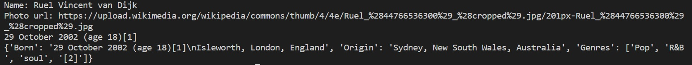

# 這是一個維基百科歌星的爬蟲專案

## 前言與動機
我想要學習如何用Python寫爬蟲，並應用到活中的場景。
此專案我決定設計一隻爬蟲程式，將我喜歡的歌手的維基資料爬下來!

## 功能介紹
只要輸入歌手的網址，維基百科歌星爬蟲就可以將出現在維基百科的歌手資料自動爬下來，存在一個 Python Dict 裡面，之後可以再用程式存成任何格式。
以下是這隻爬蟲會爬取的歌手資訊：照片、名字、生日、年齡、出生地、唱歌的類型。

## 程式設計理念與邏輯過程
這個專案我使用了 Selenium 套件，它的一個主要功能是能直接使用CSS selector選擇HTML元素，然後讀取元素的內容。有了這個套件，就不用自己寫複雜難懂的字串處理規則。
在維基百科的案例中，每個歌手資訊欄位我們都可以找出一些它特有的 CSS selector組合。以歌手名稱為例，它總是放在一個帶有 “nickname” 這個class 的 div 元素中，而且這個 class 不會出現在頁面中其他地方。因此，我們可以用 ".nickname”這個 CSS selector (意思就是帶有nickname這個class的元素) 直接找出這個歌手名稱的欄位。

對應的程式碼如下：

driver.find_element(BY.CSS_SELECTOR, “.nickname”) 

再以歌手圖片為例，它就不像歌手名稱，帶有一個頁面上只出現過一次的 class。
所以經過觀察後，我使用了比較複雜的 CSS selector：”a.image img” (意思是「帶有 image 這個 class 的 a 元素裡面的 img 元素」)，這樣便只會選到一張圖片。
選擇到了我們要的元素之後，就可以把元素的文字內容或是任何attribute讀取出來。
例如，要讀取裝有歌手名稱的 div 元素的文字內容，我使用了：
singer_name = driver.find_element(BY.CSS_SELECTOR, ”.nickname”).text 

最後歌手名字就會存在 singer_name 變數裡面。而要讀取圖片的網址，則要讀取 img 元素的 src attribute，如下：
picture = driver.find_element(BY.CSS_SELECTOR, “a.image img”) picture_url = picture.get_attribute(‘src’)
有了圖片網址，我們就可以下載到電腦上 (例如用Python requests 套件)。

## 如何使用
在開始之前，電腦上需要先安裝 Python，以及一個 Python 套件： Selenium

上述安裝完成之後，就可以開始使用「維基百科歌星爬蟲」了!

步驟如下:

1.	先找到指定歌手的維基百科網址，並貼在 crawler.py 的 WIKI_URL 變數，如以下範例： 
 WIKI_URL = 'https://en.wikipedia.org/wiki/指定的歌手名稱

2.	開啟Command line (命令提示字元)

3.	執行以下指令: python crawler.py

4. 資料存在 Dict 格式，可以很方便的寫進檔案中!
Photo url 就是歌手的圖片網址，在瀏覽器打開便會看到以下成果

## 成果

以下是我的成果展現:

### 1.照片

### 2.爬下來的資料(姓名、照片的連結、生日、出生地、歌曲類型)

